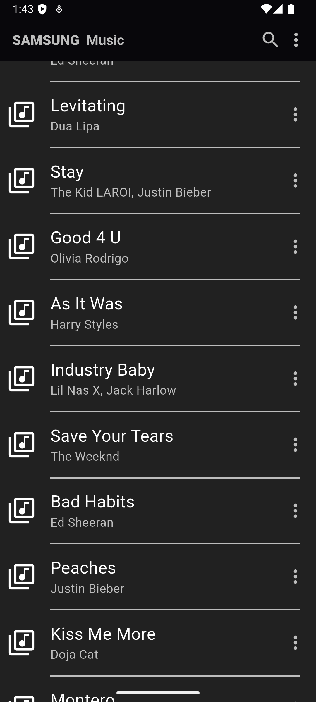

# Music List View

A simple Flutter project to display a scrollable list of music items with their details in a clean UI. The project demonstrates the use of basic Flutter widgets to create a user-friendly music list interface.

## Features 🚀

- 🎺 Display a list of music items using 'ListView.builder'
- 🖼️ Display details of music tracks
- 🎨 Simple UI design with Flutter widgets

## 📸 Screenshots

## Tech Stack 🛠️

- **Flutter** – For building the app UI
- **Dart** – Programming language for Flutter
- **Flutter Widgets** – For displaying list views and images
