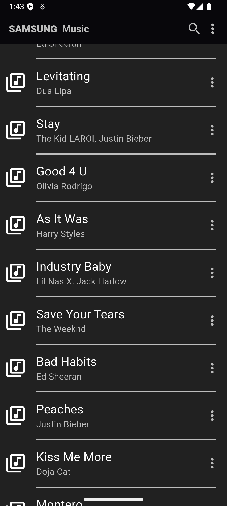

# Music List View

A simple Flutter project to display a list of music items with their details in a clean UI. The project demonstrates the use of basic Flutter widgets to create a user-friendly music list interface. It is perfect for learning how to work with Flutter and build UI layouts.

## Features

- 🎵 Display a list of music items
- 🖼️ Display images and other details of music tracks
- 🎶 Simple UI design with Flutter widgets

## Screenshots

## Tech Stack

- **Flutter** – For building the app UI
- **Dart** – Programming language for Flutter
- **Flutter Widgets** – For displaying list views and images

<!--
# music_list_view

A new Flutter project.

## Getting Started

This project is a starting point for a Flutter application.

A few resources to get you started if this is your first Flutter project:

- [Lab: Write your first Flutter app](https://docs.flutter.dev/get-started/codelab)
- [Cookbook: Useful Flutter samples](https://docs.flutter.dev/cookbook)

For help getting started with Flutter development, view the
[online documentation](https://docs.flutter.dev/), which offers tutorials,
samples, guidance on mobile development, and a full API reference.
-->